# Customer Churn Analysis

## Table of Content

-[Background](#background)

-[Objective](#objective)

-[Limitation](#limitation)

-[Data Source](#data-sources)

-[Tools](#tools)

-[Exploration Data Analysis](#exploration-data-analysis-eda)

-[Feature Engineering](#feature-engineering)

-[Machine Learning Result](#machine-learning-result)

-[Conclusion](#conclusion)

-[Reference](#references)

-[Appendix A: Feature Explanation](#appendix-a-feature-explanation)

-[Appendix B: Visualization](#appendix-b-visualization)

-[Appendix C: Build a machine learning](#-appendix-c-build-a-machine-learning)

---

## Background

Churn occurs when a customer decides to stop using a company's service. For instance, Mr. Justin had been subscribed to the telecom provider PT.xyz for two years. When his contract ended, he chose not to renew it. This decision to discontinue the service is referred to as churn. There are several potential reasons why customers like Justin may choose to leave:

1. The service is overpriced relative to the quality it delivers, meaning customers feel they’re not getting good value for what they’re paying.

2. Competitors offer the same quality of service, but at more affordable prices.

3. Consumer needs are always evolving

4. Poor provider-consumer communication regarding policy changes, updates, or unaddressed customer concerns can leave customers feeling unappreciated.

5. ineffective and non-transparent payment methods, and many other possibilities.

The type of *churn* divided by two:

1. Voluntary Churn: refers to customers who intentionally cancel a service or product. This decision is based on factors such as dissatisfaction with the service, negative customer experiences, or better offers from competitors.

2. Involuntary Churn:loss of customers that occurs not because of the customer's wishes, but because of unintentional events such as payment failure, expired credit cards, and other events.

## Objective
The goal of this project:

1. Figure out user demographics

2. Analysis of company services selected by users.

3. Analysis of user accounts

4. Find out the churn factor

## Data Sources

The dataset used is sourced from Kaggle and has around 7,000 rows and 22 columns. This project's data is quite small, making it suitable for many data scientists looking to start a data career. Moreover, this data have been cleaned, so the starters no need to do complex prerpocessing. The data contains:

1. **Demographics**: gender, SeniorCitizen, Partner, and Dependents

2. **Services**: PhoneServices, InternetServices, MultipleLines, OnlineSecurity, OnlineBackup, DeviceProtection, TechSupport, StreamingTV, StreamingMovies

3. **Customer Accounts**: Contract (Payment Contract), MonthlyCharages (Monthly Charges), TotalCharges (Total Charges), PaperlessBilling, PaymentMethod

4. **Customer Status**: Churn, tenure 

## Tools

The list of tools or libraries I used in this project:

- Scikit Learn Ver.

- Seaborn Ver. 

- Matplotlib Ver.

- Pandas Ver. 

Semua library sudah tertulis di requirement.txt.

## Exploration Data Analysis (EDA)

### Customer Demographic Analysis

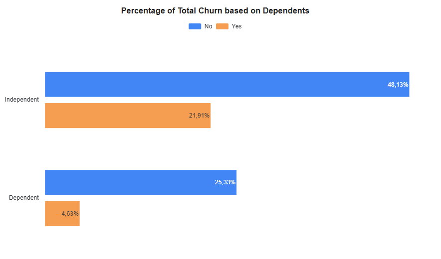

- **Dependents**: People who are financially independent—meaning they don’t rely on others for support—are more likely to stop using a service (churn) than those who still depend on someone else financially.

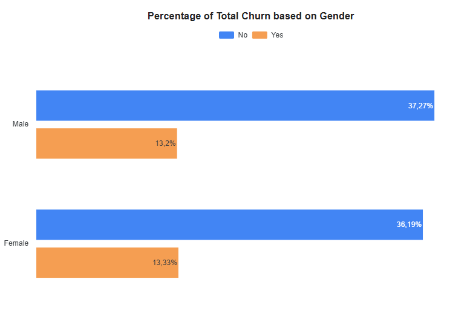

- **Gender**: The figure above shows no difference in the number of customer churns between men and women, indicating no relationship between the two variables. The churn rate for each gender is approximately 13% of the total data.

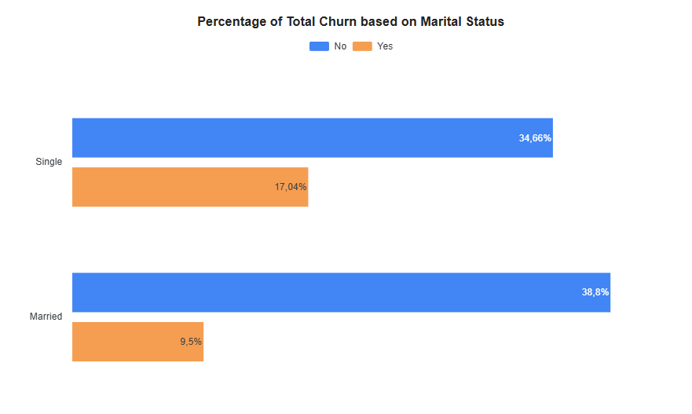

- **Marital Status**: The bar chart indicates that individuals who are single are more likely to stop using the service compared to those who are married. This trend is intriguing and may be explained by various assumptions about why single people are more inclined to churn:

    1. Singles have few financial obligations, making it easy for them to switch providers with better service facilities regardless of the price.

    2. Married users are less likely to stop using a service because they tend to choose options that benefit both themselves and their partner or family, making the service feel more worthwhile when considering the balance between cost and value.

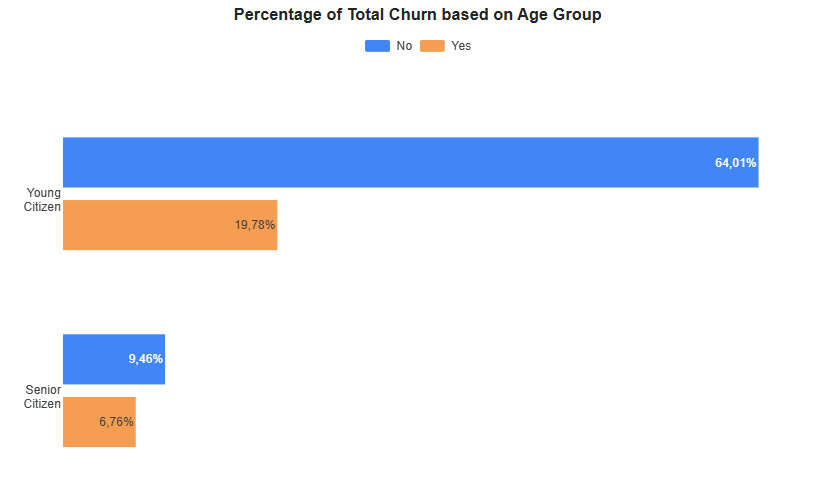

-  **Age Group**: Most users are young adults, and according to the chart, they are 15% more likely to stop using the service compared to older users. *This may be because young people often have more specific or complex needs, and competitors are offering cheaper services that better match what they’re looking for.*

### Service Analysis

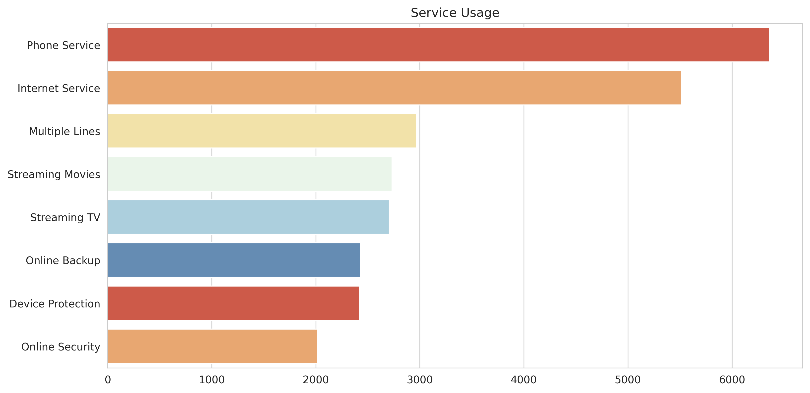

- **Customer Segmentation by Service**: Service providers offer more than just telecommunications like phone and internet—they also provide entertainment options such as movie and TV streaming, as well as security features like online backup and device protection. However, phone and internet services are used by far more people, since they are essential for every smartphone user..

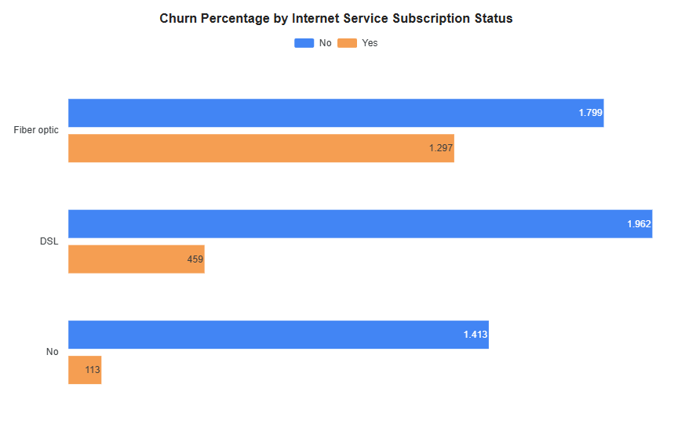

- **Internet Service**: Fiber optic internet has the highest rate of customer turnover, whereas DSL is the most commonly used and has the lowest churn rate. Both technologies are capable of transmitting data, but they differ in how that data is delivered—DSL uses traditional landline phone cables, while fiber optic relies on specialized fiber optic cables. There are several potential reasons why customers tend to favor DSL over fiber optic:

    1. Most users already have a telephone cable.

    2. More affordable monthly prices and installation compared to fiber optic

    3. DSL internet service is usually combined with Phone Service in one package (or called a bundle), so that customers only pay one monthly fee for both.

    4. This facility can be easily reached by people in both cities and rural areas, making it widely accessible—a benefit that users value.

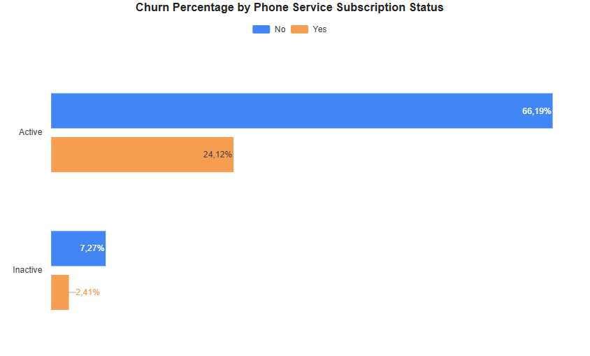

- **Phone Service**:Out of 6,000 users who selected phone service, about 1,700—or 24%—decided to stop using it. There could be several factors influencing their decision to churn:

    1. Higher monthly charges for the service.

    2. Customers’ needs are growing more complex, and as a result, they may find it difficult to afford the services that meet those needs.

    3. Dissatisfaction with the service facilities provided.

    4. Payment failures and non-transparent billing.

    5. Slow response to complaints.

    6. Nomadic customers (often moving places), whether for work, lifestyle, or another personal reason. Because they don’t stay in one location for long, they often prefer flexible service plans and are more likely to cancel or switch providers. This tendency to move around makes them more prone to churn, as long-term contracts or location-specific services may not suit their needs.

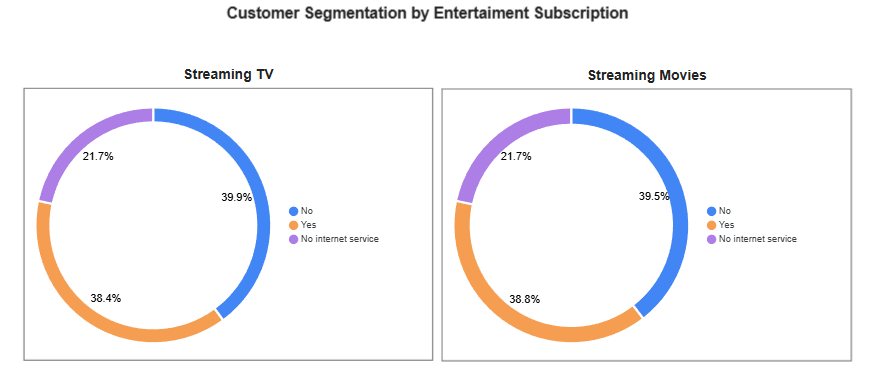

- **Entertainment**: The company provides entertainment in two main forms: TV and Movies. According to the data, the number of customers who chose the entertainment bundle ("Yes") is almost the same as those who decided not to include it ("No").

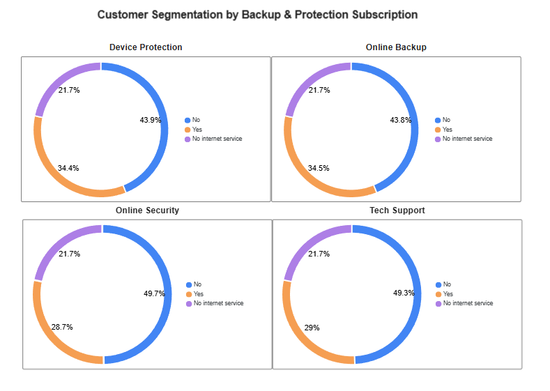

- **Security & Backup Service**: The services in the Backup & Protection category are available bundled with Internet Service and Phone Service. As seen in the image above, the majority of customers chose "No," meaning they purchased the bundle without these services. This could be due to several reasons:

    1. Customers don't really need it because their perception of the risk of cyber attacks is very low.

    2. Customers may already be using third-party protection solutions, and therefore may not be interested in internal bundling.

    3. Negative experiences or customer distrust of this service.

### Customer Account Analysis

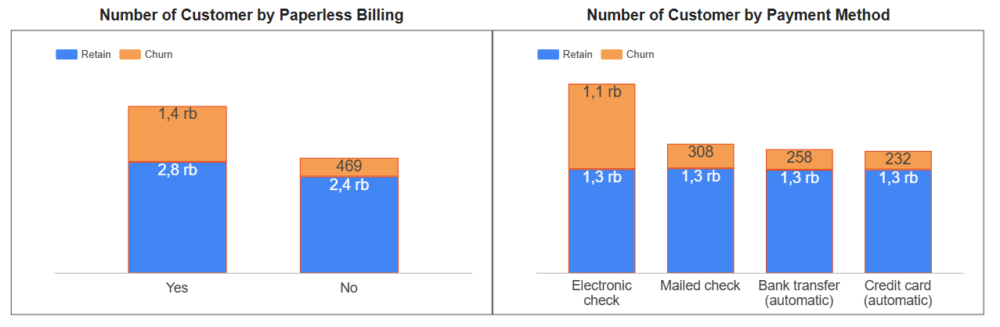

- **Paperless Billing**: Bills sent electronically via email, text message, or provider app. Most users choose this method because it's convenient and fast, as evidenced by the image on the left. As seen on the right, electronic checks are the payment method most customers choose.

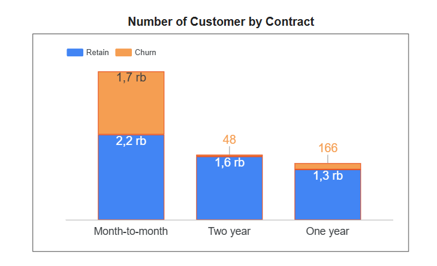

- **Contract**: length of time a customer agrees to use a service. Most customers choose a monthly (month-to-month) plan, likely because it offers more flexibility and a range of options that suit their needs.

    1. *Flexibility*: Customers are free to cancel their service whenever they want, with only a small cancellation fee. As their needs continue to grow and change, this makes them more prone to switching providers.

    2. *Down Payment*: customers who choose monthly can pay a cheaper down payment than long-term contracts.

- **Monthly Charges**: The chart on the left displays three distinct spikes in monthly charges—around $20, $50, and $80—*highlighting how customers differ based on the type of service bundle they choose*. Those paying around $20 or $50 are likely using basic or mid-level services, while those at the $80 mark are typically premium users.

- **Total Charges**: The chart on the right shows a right-skewed distribution, meaning most customers pay relatively low total costs for their services. Despite the lower spending, these services still meet their needs effectively.

### Tenure and Churn

- Tenure refers to how long a customer uses a service. The charts below illustrate how customers are spread out based on their service duration. The left chart shows that most users stay subscribed for less than a year. Meanwhile, the right chart reveals that most of them opt for month-to-month contracts, which are popular because they offer flexibility and minimal cancellation fees—ideal for users who want to test out a telecom provider’s offerings.

## Feature Engineering

The discussion in this sub-chapter covers problems that exist in data such as null values, skewness, and duplication.

### Null Value

There are no null or nan values in this dataset. 

### Skewness

Skewness is an indicator of how symmetric a data distribution is. Based on the obtained dataset, skewness happened on the MonthlyCharges and TotalCharges columns. However, in this project, the writer don't remove it.

### Duplication

This dataset does not have duplicated data.

## Machine Learning Result

This section provides the performance of various machine learning models and explores the factors driving customer churn based on model-driven analysis. It utilizes two approaches: Logistic Regression and Decision Tree.

### Logistic Regression

Logistic Regression is a parametric model used to predict categorical outcomes. Parametricity itself is a characteristic of a model that assumes a functional form connecting variables in the data (e.g., linear in linear regression) and a fixed number of parameters, regardless of the size of the data used for prediction. This model utilizes a sigmoid curve that forms an S-shape to bridge the probabilities of 0 and 1.. 

One component of the logistic regression equation is the coefficient. The coefficient is a measure of the impact of a feature if shifted by one unit. The coefficient is conditional, meaning the calculation involves only two variables—one feature and one target—and holds the other features constant. Logistic regression equation can be expressed as

$$P = \frac{1}{1 + e^{z}}$$

where $z = \beta _0 + \beta _1 X_1$ which is known as linear regression formula, while $\beta _0$, $\beta _1$, dan $ X_1$ are intercept, coefficient, and independent variable, respectively.

- The figure above shows the results of the logistic regression coefficient calculation. This coefficient was obtained after going through a series of processes such as data wrangling, feature engineering, and model training. Based on this model calculation, the total service cost (TotalCharges) is a supporting factor why customers choose to churn, followed by fiber optic internet service (InternetService_FiberOptic) and monthly contracts (Contract_Month-to-month). Conversely, tenor (tenure), unselected internet service (InternetService_No), and monthly fees (MonthlyCharges) are factors that prevent customers from leaving the service (churn).

### Decision Tree

A Decision Tree is a tree-based model used for both classification and regression tasks. It is a non-parametric model, meaning it does not assume any specific data distribution or a fixed number of parameters. Instead, it builds a hierarchical structure of decisions based on feature values, adapting its complexity to the size and nature of the dataset. This flexibility allows it to capture nonlinear relationships and interactions without requiring prior assumptions about the underlying data.

Decision trees have something similar to coefficients, called feature importances. The similarity between the two is that they measure the influence of a feature. However, feature importance measures how much a feature contributes to reducing error or improving prediction accuracy across all separations or decisions, regardless of whether the feature has a positive or negative impact on the prediction output. Coefficients, on the other hand, can be positive or negative, meaning each feature can have a positive or negative impact on the prediction.

- Based on the image, it can be seen that the highest churn factor is in the monthly contract (month-to-month contract), followed by tenor (tenure), fiber optic internet service (InternetService_Fiber optic), monthly price (MonthlyCharges), and total service price (TotalCharges).

### Performance Metrics

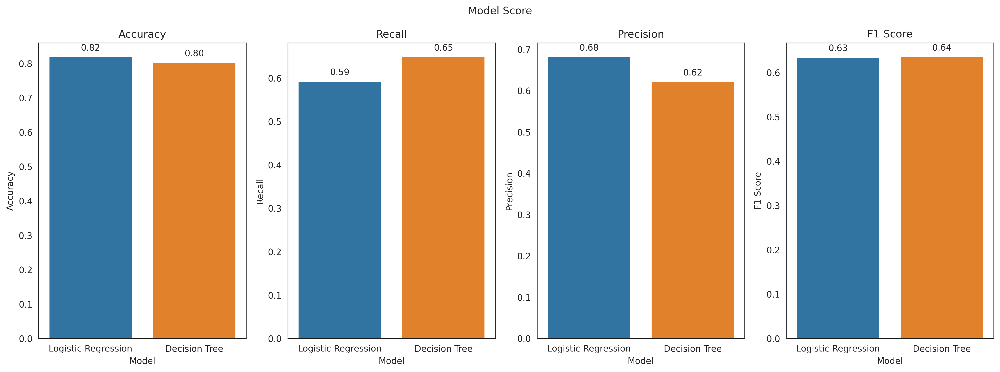

- **Accuracy**: the metric shows the abilty of model to correctly classifies both churn and retained customer. Both Logistic Regression (LR) and Decision Tree (DT) models archieve around 80% accuracy of prediction. 

- **Recall**: shows how well the model identifies churn on the data, correctly. The DT model outperforms LR by 6%, indicating that it is better at capturing customer churn present in the data.

- **Precision**: shows how much churners the model predicts is really churn. LR model overtake DT with 68% precision score. It indicates that LR is more "cautious" when detect churn. 

- **F1 Score**: harmonic mean of precision and recall, providing a balanced measure of a model's ability to correctly identify positive cases when minimizing false positive. Both models scored around 60%, indicating a moderate balance between precision and recall.

- **Strategic Implication**: If you want to minimize missed customer churn, then use DT because of its high recall score. However, if you want to avoid false alarms, then use a model with a high precision score (in this project, use LR).

- **Additional Note**: Both models achieved comparable precision and recall scores. High recall leads to lower precision, and vice versa. This is called the *precision-recall tradeoff*. 

## Conclusion

After we analyze the data, the result we get:

1. **Demographic:** Churn customers are predominantly teenagers (or young adults) who are financially independent and unmarried.

2. **Services:** Many of them choose telephone service (PhoneService) and internet service (InternetService). Internet service, especially fiber optic, is the service with the highest customer churn, while the opposite is true for DSL internet service.

3. **Account:** Customers tend to prefer month-to-month contracts and pay/renew their contracts using electronic checks. They also prefer to view their bills electronically because of the convenience of paperless billing.

4. **Churn Factor:** Based on the calculation results of the two models, several factors that statistically influence churn are tenure duration, monthly contract (Month-to-Month Contract), fiber optic internet service (InternetService_Fiber Optic), total costs (TotalCharges), and monthly costs (MonthlyCharges).

### Recommendation

Based on the analysis, we recommend that:

1. There is a need for bundling services targeting young people that cover their needs such as gaming, streaming, music, and social media.

2. In fiber optic services, investigate which parts make customers uncomfortable, whether it is the technical side, the price side, customer service, or transaction transparency.

3. Optimization of payment and billing systems, such as diversifying payment methods such as e-wallet, mobile banking, credit cards, or auto-debit for ease of transactions.

4. Combine a monthly contract with a loyalty incentive (e.g. a discount on the service price after 3 consecutive months).

